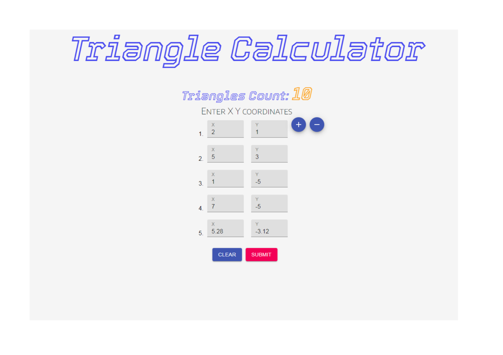

# Triangle Calculator
The program is designed to count triangles with given X Y coordinates. Backend is **JAVA** (Spring Boot), front is **REACT.js**.

___

## Getting started
1. Clone the [repository](https://github.com/Lukasevic-Robert/Triangle-counting-program)
2. Open _Spring Tools Suite_ 
3. Import project: File -> Import... -> Maven -> Existing Maven Projects -> Next -> Browse... ->
_select folder the project was saved in f. ex.:_ G:\Programs\Triangle-counting-program\ **back** -> Finish
3. Right Mouse Click on the project -> Run As -> Spring Boot App
4. Open _Visual Studio Code_
5. Open project File -> Open Folder... -> _select folder the project was saved in f.ex.:_ G:\Programs\Triangle-counting-program\ **front** -> Select Folder
3. Open terminal: Terminal -> New Terminal
4. Command in the opened terminal to install required packages:  **npm i**  
5. Command in the opened terminal to start the project: **npm start**
6. System will open on port [3000](http://localhost:3000/)

___

## root page http://localhost:3000/
Index page is "**/**" or "**/triangle-counting-with-coords**". Here you can see main page of the calculator.  
Buttons "**add / remove**" for adding and removing input fields for coordinates.  
Button "**Clear**" - clears all fields, "**Submit**" - sends request to backend.

___
